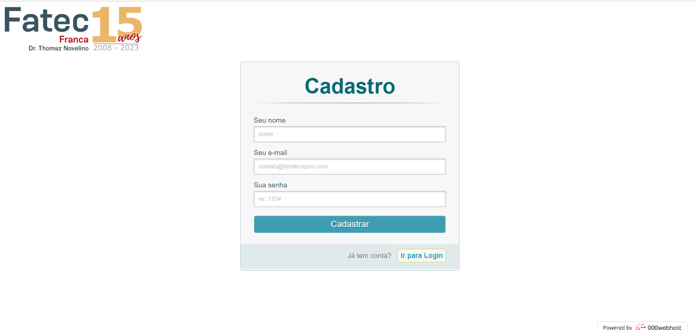
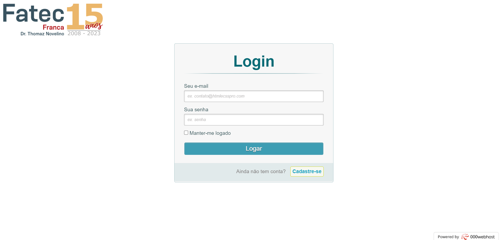
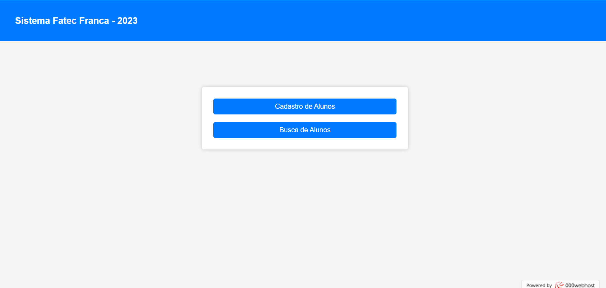
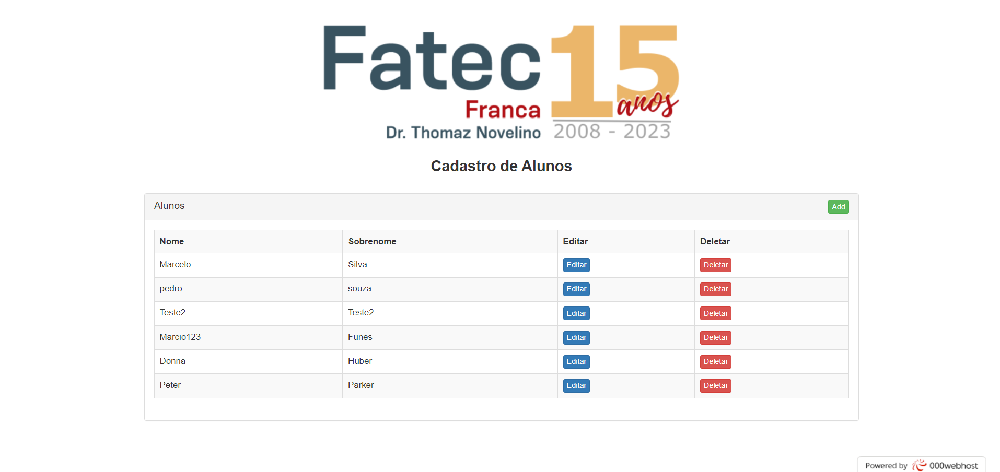
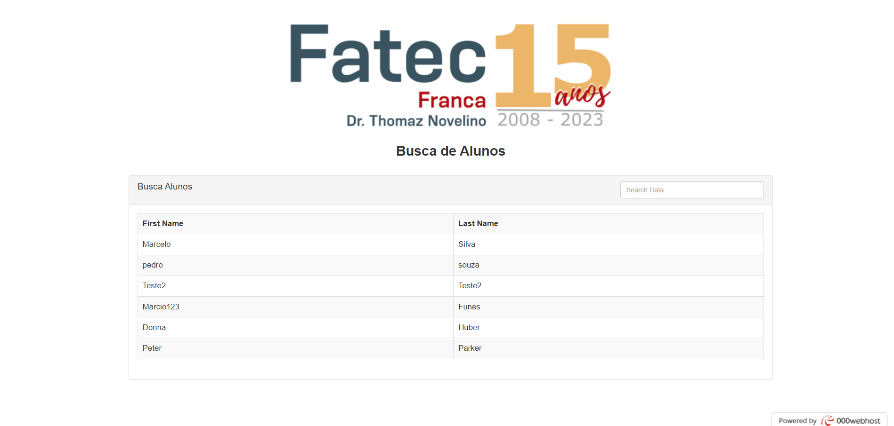

# Exemplo CRUD com BD Relacional

Projeto feito em sala de aula para testar o uso de Banco de Dados Relacional.

## 🚀 Começando

```
[I'm an inline-style link]([https://www.google.com](https://fatec-teste2.000webhostapp.com/))
```

## ✒️ Telas











